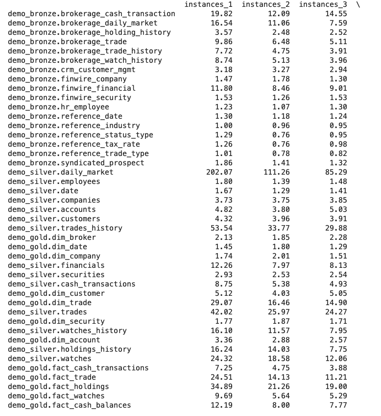
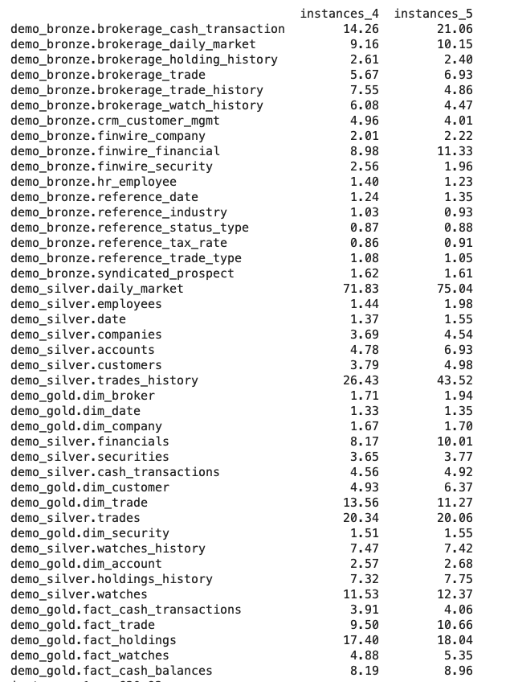
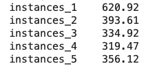
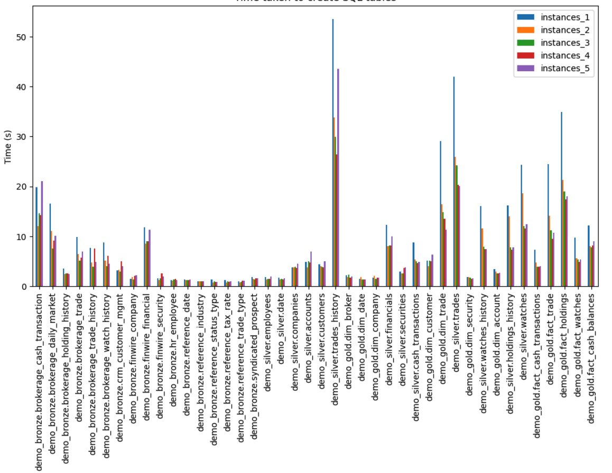

0. The goal of phase 2b is to perform benchmarking/scalability tests of sample three-tier lakehouse solution.

1. :white_check_mark: In main.tf, change machine_type at:

```
module "dataproc" {
  depends_on   = [module.vpc]
  source       = "github.com/bdg-tbd/tbd-workshop-1.git?ref=v1.0.36/modules/dataproc"
  project_name = var.project_name
  region       = var.region
  subnet       = module.vpc.subnets[local.notebook_subnet_id].id
  machine_type = "e2-standard-2"
}
```

and subsititute "e2-standard-2" with "e2-standard-4".

2. :white_check_mark: If needed request to increase cpu quotas (e.g. to 30 CPUs): 
https://console.cloud.google.com/apis/api/compute.googleapis.com/quotas?project=tbd-2023z-303876

3. :white_check_mark: Using tbd-tpc-di notebook perform dbt run with different number of executors, i.e., 1, 2, and 5, by changing:
```
 "spark.executor.instances": "2"
```

in profiles.yml.

4. :white_check_mark: In the notebook, collect console output from dbt run, then parse it and retrieve total execution time and execution times of processing each model. Save the results from each number of executors. 

**Colected time for values of spark.executor.instances equeal to 1,2,3,4,5**

  
  

5. :white_check_mark: Analyze the performance and scalability of execution times of each model. Visualize and discucss the final results.

  **Total time in [s] for each value of spark.executor.instances**

  

  **Graph of time for each model, without demo_silver.trades_history**
  

  We have drop record of demo_silver.trades_history for the purpose of visilibality of graph.


   ***Analysis of the results***

   **An interesting observation is that for less demanding tasks, where processing time is inherently shorter, changes in the number of executors are not as noticeable. This is because there's always a fixed amount of time required to initialize the process, often referred to as overhead. Therefore, for smaller tasks, this startup overhead can make up a significant portion of the total processing time, diminishing the impact of increasing the number of executors.**

    * instances_1 (620.92s): With only one executor instance, the processing time is the highest. This is expected as there is only one executor doing all the work.

    * instances_2 (393.61s): Doubling the executor instances to 2 reduces the processing time significantly. This is because the tasks are now distributed across two executors, allowing for parallel processing.

    * instances_3 (334.92s) and instances_4 (319.47s): Increasing the executor instances to 3 and 4 continues to reduce the processing time, but the reduction is less significant. This could be due to the overhead of managing more executors and distributing the tasks.

    * instances_5 (356.12s): Interestingly, increasing the executor instances to 5 results in a higher processing time than with 4 executors. This could be due to the fact that we have only 2 workers in our cluster. When the number of executor instances exceeds the number of workers, some executors might need to wait for resources to become available, which can increase the processing time.