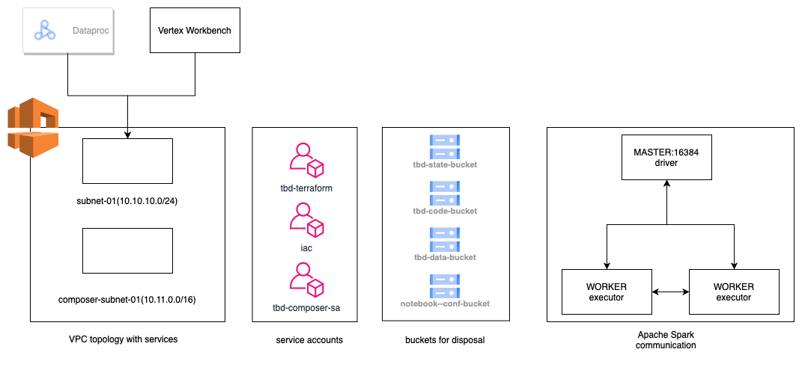

1. :white_check_mark: Authors:

   ***Group 1***
   Kacper Muszyński
   Jakub Kliszko
   Mikołaj Paszkowski

   ***https://github.com/kacpermuszynski/tbd-2023z-gr-1***
   
2. :white_check_mark: Fork https://github.com/bdg-tbd/tbd-2023z-phase1 and follow all steps in README.md.

    ***Repo cloned, URL above***

3. :white_check_mark: Select your project and set budget alerts on 5%, 25%, 50%, 80% of 50$ (in cloud console -> billing -> budget & alerts -> create buget ; unclick discounts and promotions&others while creating budget).
 
    ***Done, screenshot below***
  

4. :white_check_mark: From available Github Actions select and run destroy on main branch.

    ***Done, screenshot below***
  

5. :white_check_mark: Create new git branch and add two resources in ```/modules/data-pipeline/main.tf```:
    1. resource "google_storage_bucket" "tbd-data-bucket" -> the bucket to store data. Set the following properties:
        * project  // look for variable in variables.tf
        * name  // look for variable in variables.tf
        * location // look for variable in variables.tf
        * uniform_bucket_level_access = false #tfsec:ignore:google-storage-enable-ubla
        * force_destroy               = true
        * public_access_prevention    = "enforced"
        * if checkcov returns error, add other properties if needed
       
    2. resource "google_storage_bucket_iam_member" "tbd-data-bucket-iam-editor" -> assign role storage.objectUser to data service account. Set the following properties:
        * bucket // refer to bucket name from tbd-data-bucket
        * role   // follow the instruction above
        * member = "serviceAccount:${var.data_service_account}"

    ***insert the link to the modified file and terraform snippet here***

    ***Link to file*** https://github.com/kacpermuszynski/tbd-2023z-gr-1/blob/master/modules/data-pipeline/main.tf

    ***Snippet***
    ```terraform
    resource "google_storage_bucket" "tbd-data-bucket" {
        project                     = var.project_name
        name                        = var.data_bucket_name
        location                    = var.region
        uniform_bucket_level_access = false #tfsec:ignore:google-storage-enable-ubla
        public_access_prevention    = "enforced"
        force_destroy               = true
    }

    resource "google_storage_bucket_iam_member" "tbd-data-bucket-iam-editor" {
        bucket = google_storage_bucket.tbd-data-bucket.name
        role   = "roles/storage.objectUser"
        member = "serviceAccount:${var.data_service_account}"
    }
    ```

    Create PR from this branch to **YOUR** master and merge it to make new release. 
    
    ***place the screenshot from GA after successful application of release with this changes***

    **Successfully GA output with changes:**

    

6. :white_check_mark: Analyze terraform code. Play with terraform plan, terraform graph to investigate different modules.

    ***describe one selected module and put the output of terraform graph for this module here***

    **Terraform plan**

    Terraform plan is a command in Terraform, which lets you check what resources, will be created, deleted or update without making any changes to the real environment.

    Terraform plan is similar to terraform apply, it says how many resources will be changed, but the changes do not apply. It accepptes variables and informes about errors.

    Terraform plan reads the Terraform state file, so it it is up to date will recent configuration of all of the resources.

    **Output of Terraform graph**
    
   
7. :white_check_mark: Reach YARN UI
   
   ***place the port and the screenshot of YARN UI here***
    
    http://tbd-cluster-m:8088/cluster
    
    
   
8. Draw an architecture diagram (e.g. in draw.io) that includes:
    1. VPC topology with service assignment to subnets
    2. Description of the components of service accounts
    3. List of buckets for disposal
    4. Description of network communication (ports, why it is necessary to specify the host for the driver) of Apache Spark running from Vertex AI Workbech
  
    ***place your diagram here***

    

9. :white_check_mark: Add costs by entering the expected consumption into Infracost

    #### Expected Infrastructure Usage
    Based on the configuration defined in the infracost-usage.yml file, the expected usage of our Terraform infrastructure is as follows:

```yaml
        Google Cloud Storage Buckets
        
        General Storage Bucket

        Total size of bucket: 1.0 GB
        Monthly number of class A operations (object adds, bucket/object list): 0
        Monthly number of class B operations (object gets, retrieve bucket/object metadata): 0
        Monthly amount of data retrieved: 1.0 GB
        Monthly egress data transfer:
        Same continent: 1.0 GB
        Worldwide excluding Asia, Australia: 1.0 GB
        Asia excluding China, but including Hong Kong: 1.0 GB
        China excluding Hong Kong: 1.0 GB
        Australia: 1.0 GB
        
        
        Google Container Registry

        Total size of bucket: 1.0 GB
        Monthly number of class A operations (object adds, bucket/object list): 0
        Monthly number of class B operations (object gets, retrieve bucket/object metadata): 0
        Monthly amount of data retrieved: 1.0 GB
        Monthly egress data transfer:
        Same continent: 1.0 GB
        Worldwide excluding Asia, Australia: 1.0 GB
        Asia excluding China, but including Hong Kong: 1.0 GB
        China excluding Hong Kong: 1.0 GB
        Australia: 1.0 GB
        
        
        Vertex AI Workbench Notebook Configuration Bucket

        Total size of bucket: 1.0 GB
        Monthly number of class A operations (object adds, bucket/object list): 0
        Monthly number of class B operations (object gets, retrieve bucket/object metadata): 0
        Monthly amount of data retrieved: 1.0 GB
        Monthly egress data transfer:
        Same continent: 1.0 GB
        Worldwide excluding Asia, Australia: 1.0 GB
        Asia excluding China, but including Hong Kong: 1.0 GB
        China excluding Hong Kong: 1.0 GB
        Australia: 1.0 GB
        
        These estimates will help us predict the cost of running our infrastructure and allow us 
        to optimize our resource usage to stay within budget.
   ```
   ***place the screenshot from infracost output here***

   

10. :white_check_mark: Some resources are not supported by infracost yet. Estimate manually total costs of infrastructure based on pricing costs for region used in the project. Include costs of cloud composer, dataproc and AI vertex workbanch and them to infracost estimation.

    ***place your estimation and references here***    

    | name                                                                  |quantity                                                                             |region      |service_id    |sku                                                                              |product_description                   | unit_price, USD    | total_price, USD                |notes                    |
    |-----------------------------------------------------------------------|-------------------------------------------------------------------------------------|------------|--------------|---------------------------------------------------------------------------------|--------------------------------------|--------------------|---------------------------------|-------------------------|
    | Cloud Composer                                                        |1                                                                                    |europe-west1|1992-3666-B975|Look up for SKU https://cloud.google.com/skus/?currency=USD&filter=1992-3666-B975|CP-COMPOSER                           | 11.830892857142855 | 11.830892857142855              |                         |
    | Licensing Fee for Google Cloud Dataproc (CPU cost)                    |600                                                                                  |global      |6F81-5844-456A|DC33-D3C7-25CA                                                                   |CP-DATAPROC                           | 0.01               | 6                               |                         |
    | E2 Instance Core running in EMEA                                      |200                                                                                  |europe-west1|6F81-5844-456A|9FE0-8F60-A9F0                                                                   |CP-COMPUTEENGINE-VMIMAGE-E2-STANDARD-2| 0.02399337         | 4.798674                        |1 x Dataproc master node |
    | E2 Instance Ram running in EMEA                                       |800                                                                                  |europe-west1|6F81-5844-456A|F268-6CE7-AC16                                                                   |CP-COMPUTEENGINE-VMIMAGE-E2-STANDARD-2| 0.00321609         | 2.572872                        |1 x Dataproc master node |
    | E2 Instance Core running in EMEA                                      |200                                                                                  |europe-west1|6F81-5844-456A|9FE0-8F60-A9F0                                                                   |CP-COMPUTEENGINE-VMIMAGE-E2-STANDARD-2| 0.02399337         | 4.798674                        |1 x notebook             |
    | E2 Instance Ram running in EMEA                                       |800                                                                                  |europe-west1|6F81-5844-456A|F268-6CE7-AC16                                                                   |CP-COMPUTEENGINE-VMIMAGE-E2-STANDARD-2| 0.00321609         | 2.572872                        |1 x notebook             |
    | E2 Instance Core running in EMEA                                      |200                                                                                  |europe-west1|6F81-5844-456A|9FE0-8F60-A9F0                                                                   |CP-COMPUTEENGINE-VMIMAGE-E2-STANDARD-2| 0.02399337         | 4.798674                        |2 x Dataproc worker nodes|
    | E2 Instance Ram running in EMEA                                       |800                                                                                  |europe-west1|6F81-5844-456A|F268-6CE7-AC16                                                                   |CP-COMPUTEENGINE-VMIMAGE-E2-STANDARD-2| 0.00321609         | 2.572872                        |2 x Dataproc worker nodes|
    | Storage PD Capacity                                                   |30                                                                                   |europe-west1|6F81-5844-456A|D973-5D65-BAB2                                                                   |CP-COMPUTEENGINE-STORAGE-PD-READONLY  | 0                  | 0                               |                         |
    | Storage PD Capacity                                                   |175.4794520547945                                                                    |europe-west1|6F81-5844-456A|D973-5D65-BAB2                                                                   |CP-COMPUTEENGINE-STORAGE-PD-READONLY  | 0.04               | 7.019178082191781               |                         |
    |                                                                       |                                                                                     |            |              |                                                                                 |                                      |                    | (Total Price) 46.96470893933463 |                         |
    | Prices are in US dollars, effective date is 2023-11-04T12:28:04.701Z. |                                                                                     |            |              |                                                                                 |                                      |                    |                                 |                         |

    Above costs were calculated with the help of Google Cloud Pricing Calculator: https://cloud.google.com/products/calculator/#id=45d61bef-016c-4b71-87bb-20180c7b82fe    


   ***what are the options for cost optimization?***

   There is a lot of ways for cost optimization. Here are some of the ideas, that we could implement in our environment:
   * Instead of using virtual machines, which are running all the time, even we are not using them at the moment, we could use cloud resources, which are serverless, then we would pay only for real time of usage
   * Right-sizing, we could reduce number of workers in clusters, or change the size of virtual machine 
   * Using spot instances, if work that we are doing is not crucial(it is not a production environment) we could use a spot instances, which are much cheaper.
   * Delete unnecessary resources, as our environment is created using terraform, we could easily delete and create environment once again when it is needed, saving costs.

11. :white_check_mark: Create a BigQuery dataset and an external table
    
    ***place the code and output here***
    ```
    ❯ bq mk my_dataset
    ❯ bq mk --table --external_table_definition=@ORC=gs://tbd-2023z-292764-data/data/shakespeare/part-00000-b16e69d5-87b8-410e-a7e9-7dc6d3c01b05-c000.snappy.orc my_dataset.my_table    
    ```
    
    The provided *.orc table definition was used for creating the external big query table.
    The table has been successfully created with provided definition, as follows:
    ```
    ❯ bq show my_dataset.my_table
    Table tbd-2023z-292764:my_dataset.my_table

    Last modified              Schema               Type     Total URIs   Expiration   Labels
    ----------------- ---------------------------- ---------- ------------ ------------ -------- 
    09 Nov 22:40:29   |- word: string              EXTERNAL   1                                 
                      |- sum_word_count: integer                                                
    ```

    

   ***why does ORC not require a table schema?***
   
   The table schema is auto-generated from the ORC sample file provided in the external table creation.
  
12. :white_check_mark: Start an interactive session from Vertex AI workbench (steps 7-9 in README):

    **Screenshot of Vertex AI workbench**

    
   
13. :white_check_mark: Find and correct the error in spark-job.py

    ***describe the cause and how to find the error***
    
    The error in the spark-job.py is related to the wrong bucket name hardcoded in the script file:

    

    After fixing the bucket name, we re-run the job and the job succeeded:

    

    Therefore the *.orc file has been generated successfully:

    ```
    ❯ gsutil ls gs://tbd-2023z-292764-data/data/shakespeare
    
    gs://tbd-2023z-292764-data/data/shakespeare/part-00000-b16e69d5-87b8-410e-a7e9-7dc6d3c01b05-c000.snappy.orc
    ```

14. Additional tasks using Terraform:

    1. Add support for arbitrary machine types and worker nodes for a Dataproc cluster and JupyterLab instance

    ***place the link to the modified file and inserted terraform code***

    [Commit with modified Terraform files](https://github.com/bdg-tbd/tbd-2023z-phase1/commit/9b5eaeb1464fa3789f941601c685ae62a542f8fe)
    
    3. Add support for preemptible/spot instances in a Dataproc cluster

    ***place the link to the modified file and inserted terraform code***

    [Commit with modified Terraform files](https://github.com/bdg-tbd/tbd-2023z-phase1/commit/aad3f86637f91e9f90d2581edccaf749110e022a)
    
    3. Perform additional hardening of Jupyterlab environment, i.e. disable sudo access and enable secure boot
    
    ***place the link to the modified file and inserted terraform code***

    [Commit with modified Terraform files](https://github.com/bdg-tbd/tbd-2023z-phase1/commit/eb739cf423fd7c2d10044fde41f9b18286bc60eb)

    4. (Optional) Get access to Apache Spark WebUI

   
